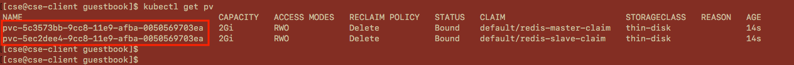
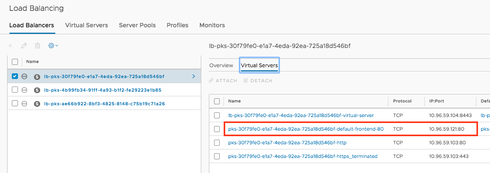
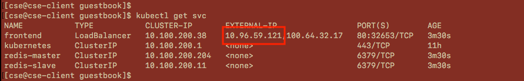
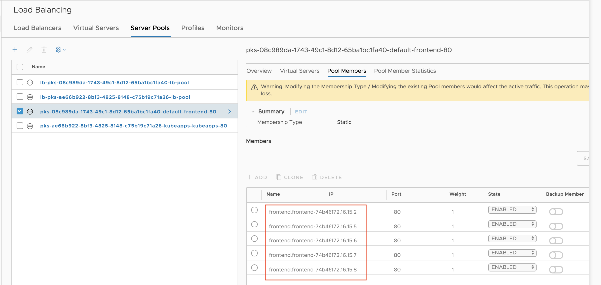

# Guestbook Demo Workflow

The guestbook app demo helps demonstrate the usage of persistent storage, which is automated via the vSphere Cloud Provider, as well as the creation of NSX-T Load Balancer for external application access. We will also showcase the built-in ingress controller offered per cluster in NSX-T.

Before starting the demo, access the `cse-client` server from your Horizon instance via putty (pw is `VMware1!`):

Also, let's ensure we are accessing the `demo-cluster` via kubectl by using `cse` to pull down the cluster config file and store it in the default location. Use your vmc.lab AD credentials to log in to the `vcd-cli`:
~~~
$ vcd login director.vcd.zpod.io cse-demo-org <username> -iw
~~~
~~~
$ vcd cse cluster config demo-cluster > ~/.kube/config
~~~
~~~
$ kubectl get nodes
NAME                                   STATUS   ROLES    AGE     VERSION
0faf789a-18db-4b3f-a91a-a9e0b213f310   Ready    <none>   5d9h    v1.13.5
713d03dc-a5de-4c0f-bbfe-ed4a31044465   Ready    <none>   5d10h   v1.13.5
8aa79ec7-b484-4451-aea8-cb5cf2020ab0   Ready    <none>   5d10h   v1.13.5
~~~

## Step 1: Create Guestbook Application

**1.1** Navigate to the `~/zPod-PKS-CSE-Demos/GuestbookDemo/` directory on the cse-client server:
~~~
$ cd ~/zPod-PKS-CSE-Demos/GuestbookDemo/
~~~
**1.2** Create a namespace in the `demo-cluster` to host our applications and set our context to ensure we are deploying workloads into this new namespace by default:
~~~
$ kubectl create namespace appspace
~~~
~~~
$ kubectl config set-context --current --namespace=appspace
~~~
**1.3** Use kubectl to deploy the storage class and persistent volume claim we will use to provide persistent storage to the `guestbook` app:
~~~
$ kubectl create -f redis-sc.yaml
$ kubectl create -f redis-master-claim.yaml
$ kubectl create -f redis-slave-claim.yaml
~~~

**1.4** View the storage resources we just created:
~~~
$ kubectl get sc
$ kubectl describe sc thin-disk
$ kubectl get pvc
$ kubectl get pv
~~~
**1.5** This would be a good time to talk about persistent storage in Kubernetes clusters and the integration with the VMware SDDC that is provided by the vSphere Cloud Provider. 

Log in to the PKS vCSA (vcsa.pks.zpod.io), navigate to the "NFS-02" datastore and select the "kubevols" folder. The VMDKs, which are persistent volumes in the kubernetes world, were automatically created by the vSphere Cloud Provider when we created our persistent volume claims. We can correlate the VMDK with the PVs as the name is the same for both resources.

**1.6** Create the components of the guestbook app and watch for the pods to be created. Feel free to review the `guestbook-aio-lb.yaml` file to understand details about what resources are doing to be deployed to support the application:
~~~
$ kubectl create -f guestbook-aio-lb.yaml
$ kubectl get pods -o wide -w
~~~
**1.7** List the services we created for the `guestbook` app and take note of the 10.96.59.X IP address for the LoadBalancer service. We will use this IP to access the guestbook app in the browser:
~~~
$ kubectl get services
~~~
**1.8** Before (or after) you access the app via the IP of the LoadBalancer service, log into the [NSX-T manager](https://nsx.pks.zpod.io) and navigate to the **Advanced Network and Security** tab. Within the **Networking** category, select the **Load Balancers** option. Find your LB instance and locate the virtual server with the `-default-fronted` suffix, note the IP address (same as LoadBalancer service)

**1.9** Navigate to the "Server Pools" tab and select the same "-default-frontend" LB. Select "Member Pools" in the menu on the right side of the UI that expands once the LB is selected. Compare IPs to the output of the following command on the CLI:

~~~
$ kubectl get pods -l tier=frontend -o wide
~~~

All of this automation is made possible by the NSX-T Container Plugin.

## Step 2: Test Data Persistance

**2.1** If you haven't already, navigate to the homepage of the `guestbook` app (IP of the LoadBalancer service from step 1.7.) and enter a couple of entries in the book. Observe the pods' labels and then use the label selector to delete all of the `backend` pods:
~~~
$ kubectl get pod -l tier=frontend
$ kubectl get pod -l tier=backend
$ kubectl delete pod -l tier=backend
$ kubectl get pod -w
~~~
The redis master and slave pods will be automatically created because they are part of a kubernetes deployment, which ensures there is always at least X number of instance of these pods running (in our case, X=1). 

**2.2** After the `backend` pods return to the "Started" state refresh the webpage to ensure the previous guestbook entries are still present. As we are using the vSphere Cloud Provider to automate the creation of VMDKs to provide persistant storage for our application, even though the database pods were deleted, the data was perserved and the entries should still be present on the website.

**2.3** Scale the frontend pods to 5 instead of 3 and monitor what happens in NSX-T:
~~~
$ kubectl get deployments
$ kubectl scale deployments frontend --replicas=5
$ kubectl get pods -l tier=frontend
~~~
**2.4** Now we should have 5 pods for the frontend deployment, up from 3. If we look in the NSX-T manager, we should observe that the additional two pods were automatically added to the server pool of the Load Balancer (ignore IP changes from previous example, utilized different cluster for this exercise). The NCP automates this entire process so there is no manually intervention needed to distribute traffic to newly created pods.

**2.5** Scale the frontend pods back down to 3 (observe the Pool Members again in NSX-T if you'd like):
~~~
$ kubectl scale deployments frontend --replicas=3
~~~
**2.6** (Optional) If continuing on to the next lab, leave the `guestbook` app running in the cluster. If you are not proceeding, please delete the application and it's resources:
~~~
$ kubectl delete -f guestbook-aio-lb.yaml
$ kubectl delete -f redis-master-claim.yaml
$ kubectl delete -f redis-slave-claim.yaml
~~~

## Conclusion

In this demo, we walked through the creation of an application that utilizes the vSphere Cloud Provider plugin to create persistent storage for the application. This application also utilizes the integration between PKS and NSX-T to automatically create an NSX-T load balancer to expose the application to external users outside of the Kubernetes cluster.

Proceed to the [next demo](https://github.com/mann1mal/zPod-PKS-CSE-Demos/tree/master/Ingress%26NSX-T) to showcase how to configure the ingress controller provided by NSX-T to front multiple applications running in a PKS Kubernetes cluster.
