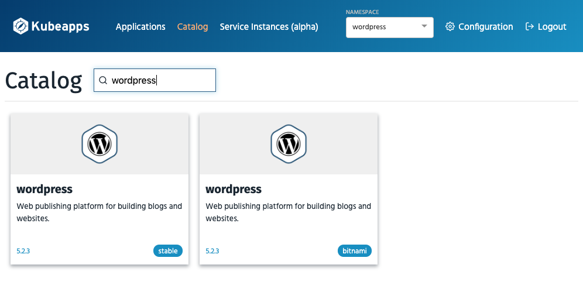
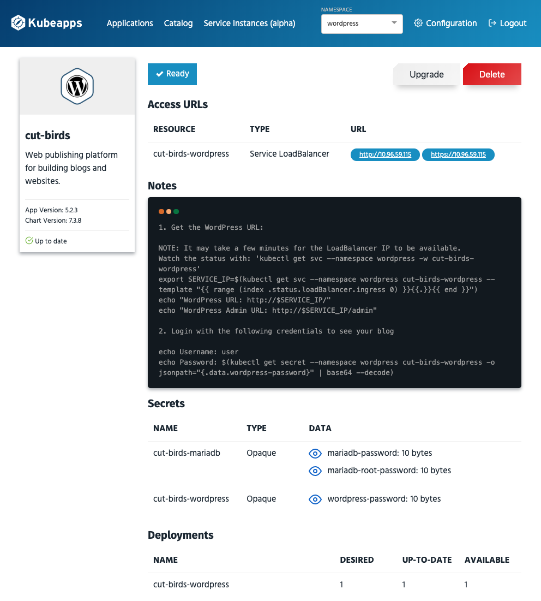
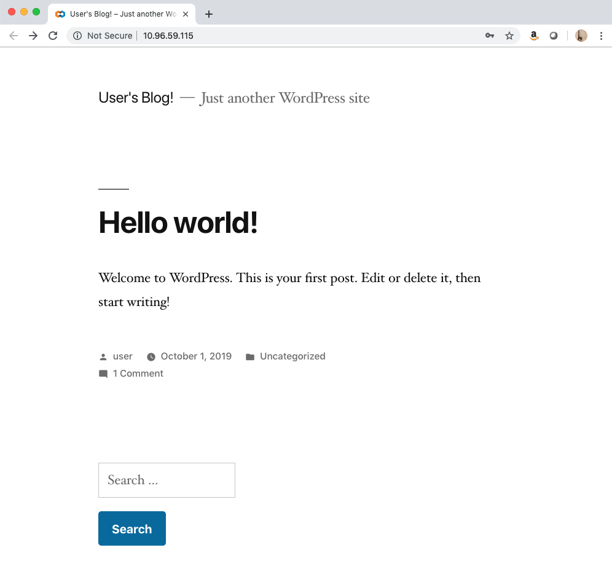
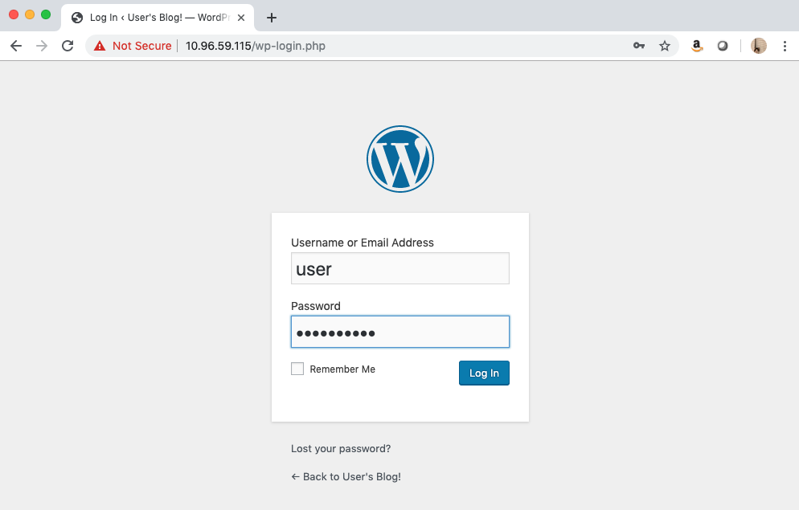
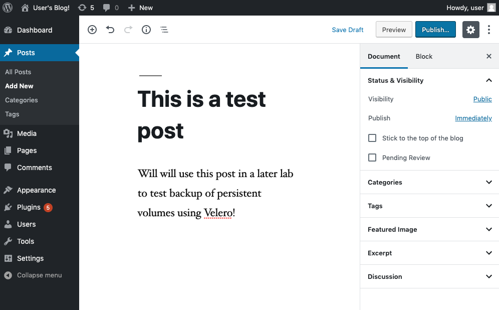
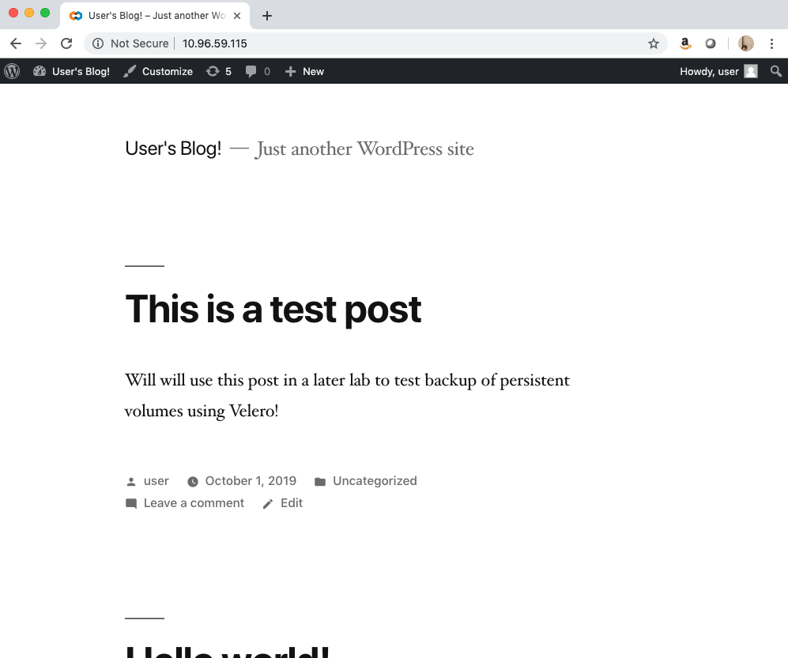

# Installing Helm and Kubeapps in `demo-cluster`

In this lab, we are going to run through the workflow of deploying [Helm](https://helm.sh) in our `demo-cluster`. We will then utilize Helm to deploy [Kubeapps](https://kubeapps.com). Kubeapps, an open source project developed by the folks at Bitnami, is a web-based UI for deploying and managing applications in Kubernetes clusters. 

Kubeapps allows users to:

* Browse and deploy Helm charts from chart repositories
* Inspect, upgrade and delete Helm-based applications installed in the cluster
* Add custom and private chart repositories (supports ChartMuseum and JFrog Artifactory)
* Browse and provision external services from the Service Catalog and available Service Brokers
* Connect Helm-based applications to external services with Service Catalog Bindings
* Secure authentication and authorization based on Kubernetes Role-Based Access Control

Finally, we'll use the Kubeapps dashboard to deploy a wordpress application with persistent storage in the cluster.

## Deploying Helm 

Before starting the demo, access the `cse-client` server from your Horizon instance via putty (pw is `VMware1!`):

Also, let's ensure we are accessing the `demo-cluster` via kubectl by using `cse` to pull down the cluster config file and store it in the default location. Use your vmc.lab AD credentials to log in to the `vcd-cli`:
~~~
$ vcd login director.vcd.zpod.io cse-demo-org <username> -iw
~~~
~~~
$ vcd cse cluster config demo-cluster > ~/.kube/config
~~~
~~~
$ kubectl get nodes

NAME                                   STATUS   ROLES    AGE     VERSION
0faf789a-18db-4b3f-a91a-a9e0b213f310   Ready    <none>   5d9h    v1.13.5
713d03dc-a5de-4c0f-bbfe-ed4a31044465   Ready    <none>   5d10h   v1.13.5
8aa79ec7-b484-4451-aea8-cb5cf2020ab0   Ready    <none>   5d10h   v1.13.5
~~~

Now we are ready to use the Helm client, which is already installed on the `cse-client` server, to deploy Helm in our cluster.

### Helm Security Considerations

Helm runs locally on the client workstation or server that is initiating Helm commands (`cse-client` in this case). Helm provides standard application package management features to allow for streamlined application deployment/management in a Kubernetes cluster. To provide this service, Helm includes an application called Tiller Server (aka Tiller) that is usually installed as a pod in the Kubernetes cluster.

When you enter a Helm command from the client to install an application, the Helm client communicates the instructions to the tiller server which interacts with the Kubernetes API to execute commands. As Tiller has the ability to execute privliedge commands within a Kubernetes cluster, it should always be installed with thorough security precautions as detailed in [Securing your Helm Installation](https://helm.sh/docs/using_helm/#securing-your-helm-installation) page in the Helm Documentation.

However, in this lab, for simplicity sake, we are going to deploy Tiller with the `cluster-admin` role so the service has access to all of the elements of the Kubernetes API to deploy our applications. This is **NOT** best practice for production but is more than acceptable in isolated/demo environments.

Now that we've learned a little bit about Helm, let's change into our `Kubeapps` directory and create the Tiller `serviceaccount` and `rolebinding` that Helm requires to run in a Kubernetes cluster:

~~~
$ cd ~/zPod-PKS-CSE-Demos/Kubeapps
~~~

~~~
$ kubectl create -f helm-rbac-config.yaml

serviceaccount/tiller created
clusterrolebinding.rbac.authorization.k8s.io/tiller created
~~~

After creating the `serviceaccount` and `rolebinding` for Tiller, we are ready to use the Helm client to deploy the Helm service in the cluster:

~~~
$ helm init --service-account tiller

Creating /home/cse/.helm 
Creating /home/cse/.helm/repository 
Creating /home/cse/.helm/repository/cache 
Creating /home/cse/.helm/repository/local 
Creating /home/cse/.helm/plugins 
Creating /home/cse/.helm/starters 
Creating /home/cse/.helm/cache/archive 
Creating /home/cse/.helm/repository/repositories.yaml 
Adding stable repo with URL: https://kubernetes-charts.storage.googleapis.com 
Adding local repo with URL: http://127.0.0.1:8879/charts 
$HELM_HOME has been configured at /home/joe/.helm.

Tiller (the Helm server-side component) has been installed into your Kubernetes Cluster.

Please note: by default, Tiller is deployed with an insecure 'allow unauthenticated users' policy.
To prevent this, run `helm init` with the --tiller-tls-verify flag.
For more information on securing your installation see: https://docs.helm.sh/using_helm/#securing-your-helm-installation
~~~

Verify that the `tiller-deploy` pod is running and in ready status via `kubectl`:

~~~
$ kubectl get pods -n kube-system

NAME                                    READY   STATUS    RESTARTS   AGE
coredns-95489c5c9-btdq7                 1/1     Running   0          4h55m
coredns-95489c5c9-p95nf                 1/1     Running   0          4h55m
coredns-95489c5c9-wv2vz                 1/1     Running   0          4h55m
kubernetes-dashboard-558689fc66-bd9kk   1/1     Running   0          4h55m
metrics-server-867b8fdb7d-mflv6         1/1     Running   0          4h55m
tiller-deploy-9bf6fb76d-gbcks           1/1     Running   0          40s
~~~

Verify we are able to list Helm repos via the client:

~~~
$ helm repo list

NAME   	URL                                             
stable 	https://kubernetes-charts.storage.googleapis.com
local  	http://127.0.0.1:8879/charts                    
~~~

Great! Helm has been succesfully installed in the cluster. Now we are ready to deploy the Kubeapps Helm chart.

## Deploying Kubeapps via Helm chart

Helm uses a packaging format called charts. A chart is a collection of files that describe a related set of Kubernetes resources. A single chart might be used to deploy something simple, like a memcached pod, or something complex, like a full web app stack with HTTP servers, databases, caches, and so on. Kubeapps uses Helm charts to deploy application stacks to Kubernetes clusters so Helm must be deployed in the cluster prior to deploying Kubeapps. We'll also use Helm to deploy Kubeapps itself in this lab.

First, add the `bitnami` Helm repo with the client:

~~~
$ helm repo add bitnami https://charts.bitnami.com/bitnami
~~~

Create a Kubernetes namespace called `kubeapps` that will be used to house the Kubeapps deployment:

~~~
$ kubectl create namespace kubeapps
~~~

In order for Kubeapps to be able to deploy applications into the cluster, we will need to create a Kubeapps service account and role binding, much like we did for the Tiller Server. Again, for simplicity sake, we are going to deploy the `kubeapps-operator` service account with the `cluster-admin` role so the service has access to all of the elements of the Kubernetes API to deploy our applications. Again, this is **NOT** best practice for a production deployment. For more information on securing your Kubeapps service, refer to the [Kubeapps documentation.](https://github.com/kubeapps/kubeapps/blob/master/docs/user/securing-kubeapps.md)

Create the `serviceaccount` and `rolebinding` the Kubeapps service requires:

~~~
$ kubectl create clusterrolebinding kubeapps-operator \
--clusterrole=cluster-admin \
--serviceaccount=default:kubeapps-operator
~~~

Use the Helm client to deploy the Kubeapps chart:

~~~
$ helm install --name kubeapps --namespace kubeapps bitnami/kubeapps \
--set mongodb.securityContext.enabled=false \
--set mongodb.mongodbEnableIPv6=false
~~~

Monitor the output of the below `kubectl` command to confirm when all pods in the `kubeapps` namespace are in a `Running` or `Completed`

~~~
$ kubectl get pods,services -n kubeapps
NAME                                                             READY   STATUS      RESTARTS   AGE
pod/apprepo-sync-bitnami-bnf7j-d8vp5                             1/1     Running     1          53s
pod/apprepo-sync-incubator-z2zq6-jkv96                           0/1     Completed   1          53s
pod/apprepo-sync-stable-9pw4s-gtbhf                              1/1     Running     1          53s
pod/apprepo-sync-svc-cat-sb25z-6npsd                             0/1     Completed   1          53s
pod/kubeapps-6c8d4bf9c-8m7b6                                     1/1     Running     0          64s
pod/kubeapps-6c8d4bf9c-lb85h                                     1/1     Running     0          64s
pod/kubeapps-internal-apprepository-controller-55fcd5966-ht8vc   1/1     Running     0          64s
pod/kubeapps-internal-chartsvc-7fc7bc4fc5-jp48r                  1/1     Running     1          64s
pod/kubeapps-internal-chartsvc-7fc7bc4fc5-v987s                  1/1     Running     1          64s
pod/kubeapps-internal-dashboard-676d44f9f5-hffxw                 1/1     Running     0          64s
pod/kubeapps-internal-dashboard-676d44f9f5-nwknr                 1/1     Running     0          64s
pod/kubeapps-internal-tiller-proxy-696ffcd799-jjc7w              1/1     Running     0          64s
pod/kubeapps-internal-tiller-proxy-696ffcd799-lhfkw              1/1     Running     0          64s
pod/kubeapps-mongodb-6cbcc9ffd4-lgnb5                            1/1     Running     0          64s

NAME                                     TYPE        CLUSTER-IP       EXTERNAL-IP   PORT(S)     AGE
service/kubeapps                         ClusterIP   10.100.200.227   <none>        80/TCP      64s
service/kubeapps-internal-chartsvc       ClusterIP   10.100.200.13    <none>        8080/TCP    64s
service/kubeapps-internal-dashboard      ClusterIP   10.100.200.28    <none>        8080/TCP    64s
service/kubeapps-internal-tiller-proxy   ClusterIP   10.100.200.69    <none>        8080/TCP    64s
service/kubeapps-mongodb                 ClusterIP   10.100.200.138   <none>        27017/TCP   64s
~~~

Note that we've only deployed service type of `ClusterIP` for our Kubeapps service. In order to allow access to the Kubeapps web UI from outside of the cluster, we need to expose the service via `LoadBalancer` service type or an ingress controller. As this cluster is deployed using Enterprise PKS with NSX-T integration, we can use the built-in ingress controller provided by NSX-T to expose Kubeapps.

Create the ingress resource for the Kubeapps dashboard via the following `kubectl` command:

~~~
$ kubectl create -f kubeapps-ingress.yaml
~~~

Verify the resource was created and note the URL under the `HOSTS` section:

~~~
kubectl get ingress -n kubeapps

NAME               HOSTS                       ADDRESS        PORTS   AGE
kubeapps-ingress   kubeapps.demo.pks.zpod.io   10.96.59.X     80      3h29m
~~~

Before accessing the URL above, we'll need to obtain credentials that will allow us to login to the dashboard. The Kubeapps dashboard will require a bearer token for access. You can use the following command to obtain the token for the `kubeapps-operator` service account:

~~~
kubectl get secret $(kubectl get serviceaccount kubeapps-operator -o jsonpath='{.secrets[].name}') \
-o jsonpath='{.data.token}' -o go-template='{{.data.token | base64decode}}' && echo
~~~

Open a web browser and navigate to the URL obtained from the `kubectl get ingress -n kubeapps` command. Copy the token obtained from the previous command and paste in `Token` field. Select `Login`

You have succesfully deployed Kubeapps via a Helm chart and have logged into the dashboard utilizing the bearer token from the `kubeapps-operator` service account.

## Deploying Wordpress with Persistent Storage

Now we're ready to use the Kubeapps dashboard to deploy an application to the cluster. We are going to deploy the Wordpress application and utilize persistent storage to prepare for the Velero backup and recovery exercise.

First, create a Kubernetes namespace to house our Wordpress application and all it's required resources:

~~~
$ kubectl create namespace wordpress
~~~

Navigate back to the Kubeapps dashboard. Select the recently created `wordpress` namespace from the dropdown menu in the top right hand corner. This will ensure the Kubeapps service deploys our application to the correct namespace.

**Note**: You may need to refresh the web browser if the `wordpress` does not appear in the dropdown

 

After selecting the desired namespace, click `Catalog` and search for "Wordpress." Click on the Wordpress tile from the `Stable` repo:

Review the contents of the webpage, which give additional usage information regarding the Wordpress chart, including `values` that can be set by the user to customize the deploy. When ready, click the `Deploy` button in the top right hand corner:

The next page will display a .yaml file that describes the application deployment. Review the file and note the 2 sections that reference persistant storage, one for `mariadb` and one for wordpress itself. Change both `size` values to `4Gi`, as noted in the screenhots below:

After making those 2 changes, select the "Submit" option to deploy the wordpress application.

Return to the `cse-client` putty session and monitor the deployment. Run the following command and wait for both pods to display the `1/1` value under the "READY" column.

~~~
$ kubectl get pods -n wordpress -w

NAME                                  READY   STATUS    RESTARTS   AGE
cut-birds-mariadb-0                   0/1     Running   0          19s
cut-birds-wordpress-fbb7f5b76-lm5bh   0/1     Running   0          19s
cut-birds-mariadb-0   1/1   Running   0     38s
cut-birds-wordpress-fbb7f5b76-lm5bh   1/1   Running   0     112s
~~~

Explore all of the Kubernetes resources created by Kubeapps to support the wordpress application:

~~~
$ kubectl get all -n wordpress
NAME                                      READY   STATUS    RESTARTS   AGE
pod/cut-birds-mariadb-0                   1/1     Running   0          2m33s
pod/cut-birds-wordpress-fbb7f5b76-lm5bh   1/1     Running   0          2m33s

NAME                          TYPE           CLUSTER-IP      EXTERNAL-IP    PORT(S)                      AGE
service/cut-birds-mariadb     ClusterIP      10.100.200.87   <none>         3306/TCP                     2m33s
service/cut-birds-wordpress   LoadBalancer   10.100.200.72   10.96.59.115   80:32370/TCP,443:31918/TCP   2m33s

NAME                                  READY   UP-TO-DATE   AVAILABLE   AGE
deployment.apps/cut-birds-wordpress   1/1     1            1           2m33s

NAME                                            DESIRED   CURRENT   READY   AGE
replicaset.apps/cut-birds-wordpress-fbb7f5b76   1         1         1       2m33s

NAME                                 READY   AGE
statefulset.apps/cut-birds-mariadb   1/1     2m33s
~~~

Kubeapps also instructed the Kubernetes API to provision two 4Gi `persistentvolumeclaims` (PVC) to support the application. As discussed in our Guestbook lab, the vSphere Cloud Provider automatically created VMDKs to back the PVCs. Verify they were created and are in a `Bound` status:

~~~
$ kubectl get pvc -n wordpress

NAME                       STATUS   VOLUME                                     CAPACITY   ACCESS MODES   STORAGECLASS   AGE
cut-birds-wordpress        Bound    pvc-3274d8a1-e48e-11e9-9358-005056970179   4Gi        RWO            thin-disk      2m33s
data-cut-birds-mariadb-0   Bound    pvc-32859ea5-e48e-11e9-9358-005056970179   4Gi        RWO            thin-disk      2m33s

~~~

As discussed earlier, Kubeapps actually uses Helm to deploy the applications called via the UI. Utilize the Helm client to verify both the wordpress deployment (which will receive a random two-word name, `cut-birds` in my case) and the Kubeapps deployment are visible:

~~~
$ helm ls
NAME     	REVISION	UPDATED                 	STATUS  	CHART          	APP VERSION	NAMESPACE
cut-birds	1       	Tue Oct  1 16:58:19 2019	DEPLOYED	wordpress-7.3.8	5.2.3      	wordpress
kubeapps 	1       	Tue Oct  1 16:22:52 2019	DEPLOYED	kubeapps-2.1.5 	v1.5.1     	kubeapps 
~~~

Navigate back to the Kubeapps dashboard and refresh the broswer. You should notice the deployment is in a "Ready" state. Review the page for information on accessing the Wordpress dashboard. 

Notice the IP displayed under the "URL" column at the top of the screen. This is the public IP address that will be used to access the Wordpress site. This "LoadBalancer" service type will utilize an NSX-T L4 Load Balancer to allow external access to the site. Open another browser tab and navigate to the IP address of the `LoadBalancer` service (you should see a generic Wordpress homepage):

Create a sample post to populate the blog with custom data we can use to test our backup in the Velero lab. Navigate to the bottom of the page and select the "Log In" option. 

Navigate back to the status page of the Wordpress application in the Kubeapps dashboard. In the "Notes" section, there are instructions for obtaining access credentials to log in to the admin portal of the Wordpress application. Run the following command to retrieve the password for the `user` user to allow for login to the Wordpress admin portal:

~~~
$ echo Password: $(kubectl get secret --namespace wordpress cut-birds-wordpress -o jsonpath="{.data.wordpress-password}" | base64 --decode)

Password: <your-password>
~~~

Once you've logged into the admin portal, select "Posts > Add New" to create a new blog post:

Populate the post with filler content and select "Publish" in the top right hand corner:

Navigate back to the blog homepage to verify your post is visible:

If you intend to move on to the Velero lab, you are finished. If you do not intend to complete the Velero lab at this time, please delete all of the resources created in this lab in order to clean up for subsequent users:

~~~
$ kubectl delete namespace wordpress
$ kubectl delete namespace kubeapps
$ kubectl delete -f helm-rbac-config.yaml
$ kubectl delete -f kubeapps-ingress.yaml
$ kubectl delete clusterrolebinding kubeapps-operator \
--clusterrole=cluster-admin \
--serviceaccount=default:kubeapps-operator
~~~

## Conclusion

In this exercise, you deployed both Helm and Kubeapps in the `demo-cluster`. You also utilized the Kubeapps dashboard to deploy a Wordpress application that utilizes persistent storage.

