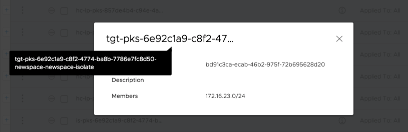
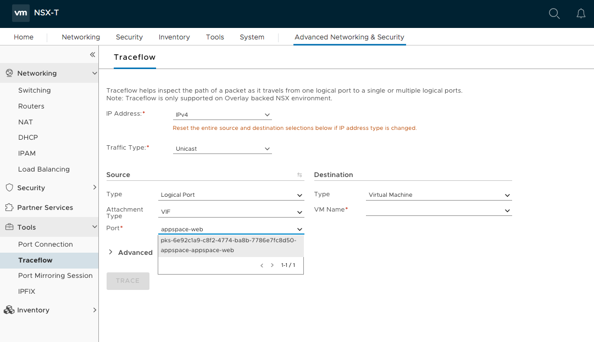
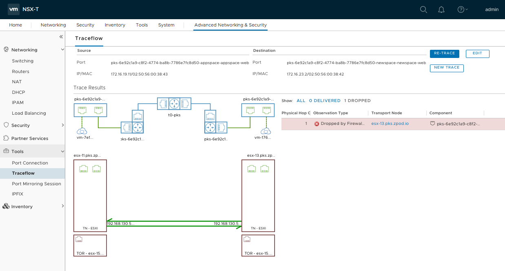
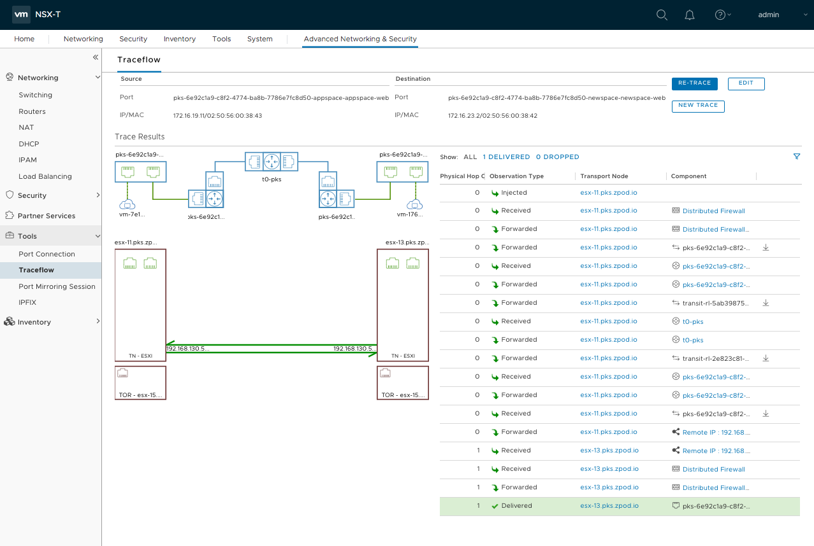

# Namespace Isolation with Network Policies and NSX-T

As was pointed out in our [first demo](https://github.com/mann1mal/zPod-PKS-CSE-Demos/tree/master/CSERBACDemo), the Container Service Extension automatically provisions NSX-T Distributed Firewall rules to ensure that each clusters' workloads are isolated from other clusters' workloads. But what if you'd like to share a single cluster with multiple users/groups instead of provisioning a dedicated cluster for each group?

One option is to utilize Network Policies to ensure network traffic can not traverse [namespaces](https://kubernetes.io/docs/concepts/overview/working-with-objects/namespaces/) within a cluster. In one of our previous demos, we created the `appspace` namespace to house our applications. We're now going to onboard a new team that will deploy their applications to the `newspace` namespace. We'll also ensure pods from each namespace can't communicate with each other.

As detailed in the [previous demo](https://github.com/mann1mal/zPod-PKS-CSE-Demos/tree/master/NetworkPolicy) Enterprise PKS Kubernetes clusters using NSX-T as the Container Network Interface (CNI) will have DFW rules automatically created in NSX-T when we create Network Policies. We will showcase this functionality again in this demo to isolate namespace network traffic.

### Accessing the `demo-cluster`

Before starting the demo, access the `cse-client` server with the `cse` user (`cse@cse-client.vcd.zpod.io`) from your Horizon instance via putty (pw is `VMware1!`):

Ensure you are accessing the `demo-cluster` via kubectl by using the `cse` CLI extension to pull down the cluster config file and store it in the default location, if you haven't done so in a previous lab. Use the `cse-ent-user` with password `VMware1!` to log in to the `vcd-cli`:

~~~
$ vcd login director.vcd.zpod.io cse-demo-org cse-ent-user -iw
~~~
~~~
$ vcd cse cluster config demo-cluster > ~/.kube/config
~~~
~~~
$ kubectl get nodes
NAME                                   STATUS   ROLES    AGE     VERSION
0faf789a-18db-4b3f-a91a-a9e0b213f310   Ready    <none>   5d9h    v1.13.5
713d03dc-a5de-4c0f-bbfe-ed4a31044465   Ready    <none>   5d10h   v1.13.5
8aa79ec7-b484-4451-aea8-cb5cf2020ab0   Ready    <none>   5d10h   v1.13.5
~~~

## Step 1: Testing Default Kubernetes Pod-to-Pod Network Connectivity

**1.1** First, create our new namespace for our team of developers:
~~~
$ kubectl create namespace newspace
~~~
**1.2** Also, if you haven't done the previous labs, create the `appspace` namespace as well:
~~~
$ kubectl create namespace appspace
~~~
**1.3** Let's create some apps we can use to test our policies in each namespace. We are going to deploy a nginx application in each namespace and instruct Kubernetes to serve out the nginx homepage on port 80 within the cluster. We're also going to label each pod:
~~~
$ kubectl run appspace-web --restart=Never --namespace appspace --image=nginx --labels=app=appspace-web --expose --port 80
$ kubectl run newspace-web --restart=Never --namespace newspace --image=nginx --labels=app=newspace-web --expose --port 80
~~~
**1.4** Now before we set any network policies up, let's test whether or not the two pods can communicate with each other. 

Let's get the name and IP address of each pod:
~~~
$ kubectl get pods -n appspace -o wide
NAME                            READY   STATUS    RESTARTS   AGE     IP      
appspace-web   1/1     Running   0          2m58s   172.16.19.2
~~~
~~~
$ kubectl get pods -n newspace -o wide
NAME                            READY   STATUS    RESTARTS   AGE     IP            
newspace-web   1/1     Running   0          2m22s   172.16.23.2   
~~~
Note the `appspace-web` pod has an IP of `172.16.19.2` while the `newspace-web` pod has an IP of `172.16.23.2`. 

**1.5** Deploy an apline linux pod in the `appspace` namespace and try to query the nginx webpage in the `newspace` namespace from the shell of the apline pod:
~~~
$ kubectl run test --namespace=appspace --rm -i -t --image=alpine -- sh

/ # wget -qO- --timeout=2 http://172.16.23.2

<!DOCTYPE html>
<html>
<head>
<title>Welcome to nginx!</title>

</head>
<body>
<h1>Welcome to nginx!</h1>

If you see this page, the nginx web server is successfully installed and
working. Further configuration is required.

For online documentation and support please refer to
<a href="http://nginx.org/">nginx.org</a>. 
Commercial support is available at
<a href="http://nginx.com/">nginx.com</a>.

<em>Thank you for using nginx.</em>

</body>
</html>
~~~
(Feel free to try this same test the other way around (alpine pod in `newspace` quering pod in `appspace`, will work just the same)

**1.6** Type `exit` to leave the alpine pod's shell and return to the `cse-client` server's command prompt.

As mentioned in our previous Network Policy demo, the default config in Kubernetes is to allow all traffic to all pods in the cluster which is why we can communicate across namespaces in the example above. Now we can focus on locking each namespace down.

## Step 2: Isolating Network Traffic per Namespace

The first thing we need to do is set a network policy on each namespace that will deny all ingress traffic to pods no matter the source, similar to a traditional firewall policies with a any-any-any-deny rule to drop all non-explicitly allowed traffic.

**2.1** Navigate to the `~/zPod-PKS-CSE-Demos/NamespaceIsolation` directory on the cse-client server:
~~~
cd ~/zPod-PKS-CSE-Demos/NamespaceIsolation
~~~
**2.2** Examine the `appspace-deny-all.yaml` file we'll use to create our deny all Network Policy for the `appspace` namespace:
~~~
kind: NetworkPolicy
apiVersion: networking.k8s.io/v1
metadata:
  name: appspace-deny-all
  namespace: appspace
spec:
  podSelector:
    matchLabels: {}
  policyTypes:
  - Ingress
~~~
This policy selects all pods in the namespace (because `spec.podSelector.matchLabels` is blank) as the source and leaves ingress undefined which means no inbound traffic allowed. This means that even pods within the `appspace` namespace can't communicate with each other

**2.3** Also Examine the `appspace-allow-pod.yaml` file, which will allow pod-to-pod traffic for all pods within the `appspace` namespace only:
~~~
kind: NetworkPolicy
apiVersion: networking.k8s.io/v1
metadata:
  namespace: appspace
  name: isolate-appspace
spec:
  podSelector:
    matchLabels:
  ingress:
  - from:
    - podSelector: {}
~~~
Again, because `spec.podSelector.matchLabels` is blank, this applies to all pods within the `appspace` namespace just like the deny all policy but in this example, we set a value for `spec.ingress.from.podSelector`, but leave it blank to allow ingress to ALL pods within the `appspace` namespace.

**2.4** Now we are ready to deploy the 4 Network Policies in our cluster:
~~~
$ kubectl create -f appspace-deny-all.yaml
$ kubectl create -f appspace-isolate.yaml
$ kubectl create -f newspace-deny-all.yaml
$ kubectl create -f newspace-isolate.yaml
~~~
**2.5** Confirm the Network Policies were created and applied to the correct namespaces:
~~~
$ kubectl get networkpolicy --all-namespaces
NAMESPACE   NAME                POD-SELECTOR   AGE
appspace    appspace-deny-all   <none>         13m
appspace    appspace-isolate    <none>         71s
newspace    newspace-deny-all   <none>         64s
newspace    newspace-isolate    <none>         55s
~~~
**2.6** Now before we try our test again, let's hop over the NSX-T manager and have a look at the DFW rules that were created. log in to the [NSX-T manager](https://nsx.pks.zpod.io) and navigate to the **Advanced Network and Security** tab. Select the **Security** > **Distrubuted Firewall Rule** tab on the left hand menu. Locate the one of the `ip-pks-9d53ebe7-46ab-4c69-a8b0-4bde4ff1e1a1...` rules and expand the it:

**2.7** The NSX Container Plugin (NCP) automatically created this rule to allow traffic from these two port groups when we created our network policy. If we click on both `Source` and `Destination` groups, we can gather more information about the members of the group:

As we can see from the screenshots, the `source` and `destination` groups are both the same (the `172.16.23.0/24` network): the network assigned to our `newspace` namespace. This is the DFW rule that was created from our `newspace-isolate` Newtork Policy to allow pods within the `newspace` namespace to communicate with each other.

**2.8** Look towards the bottom of the list and select one of the `pks-9d53ebe7-46ab-4c69-a8b0-4bde4ff1e1a1...` rules. Hover over the rule name until you find the one ending in `...newspace-deny-all` and examine this rule. This rule drops all traffic from source of `Any` to a target group. If we select the target group, we can can confirm this rule is applied to the `172.16.23.0/24` as well:

This DFW rule was created by the NCP when we created our `newspace-deny-all` Network Policy.

**2.9** Now we're finally ready to test our work! Deploy another apline linux pod in the `appspace` namespace and try to query the nginx webpage in the `newspace` namespace from the shell of the apline pod. We can also try to access the nginx webpage being served up by our app in the `appspace` namespace as well:
~~~
$ kubectl run test --namespace=appspace --rm -i -t --image=alpine -- sh

/ # wget -qO- --timeout=2 http://172.16.23.2
wget: download timed out

/ # wget -qO- --timeout=2 http://172.16.19.2
<!DOCTYPE html>
<html>
<head>
<title>Welcome to nginx!</title>

</head>
<body>
<h1>Welcome to nginx!</h1>

If you see this page, the nginx web server is successfully installed and
working. Further configuration is required.

For online documentation and support please refer to
<a href="http://nginx.org/">nginx.org</a>. 
Commercial support is available at
<a href="http://nginx.com/">nginx.com</a>.

<em>Thank you for using nginx.</em>

</body>
</html>
~~~
Our policies are working as expecting, pods can communicate with other pods in their own namespace but not pods in other namespaces.

## Step 3: Examining Pod to Pod Traffic with Traceflow

The easiest way to troubleshoot connectivity between Pods or between Pods & VMs is to use NSX-T Traceflow. Traceflow could emulate any kind of traffic and it will show what is blocking it in case a Firewall Rule or a Kubernetes Network Policy is blocking that traffic. Let's emulate a traffic between our two nginx pods in seperate namespaces and see what happens.

**3.1** Log in to the [NSX-T manager](https://nsx.pks.zpod.io) and the navigate to the **Advanced Network and Security** tab. Expand the **Tools** section in the left hand menu and select **Traceflow**. Now we need instruct Traceflow to emulate traffic between the logical ports that are connected to the virtual interfaces of the pods.

**3.2** Under the **Source** section, select **Logical Port** from the dropdown menu. Then choose **VIF** as the attachment type as we are going to emulate traffic from the virtual interface of the pod. In the **Port** section, type `appspace-web` and select the logical port for our `appspace-web` pod:

**3.3** Repeat the proccess for **Destination** section but instead, reference the `appspace-web`'s virtual interface. Now select the **Trace** button:

**3.4** As we can see from the screenshot, the packet was dropped by our DFW rule, as expected. Now let's delete all of the network policies on the cluster and run the trace again by selecting the **Re-Trace** button in the top right hand corner:

When the Network Policies were deleted, the NCP sent the request to the NSX-T Manager to delete the DFW rules, so our pods can communicate with each other again, as verified in the new trace above. Traceflow can be an incredibly helpful tool in helping developers and infrastructure teams work together to troubleshoot network connectivity issues within Kubernetes clusters.

## Step 4: Clean Up

**4.1** Now that we're done with our testing, navigate back over to the CLI of the `cse-client` server and delete the nginx pods and services:
~~~
$ kubectl delete pods -n newspace newspace-web
$ kubectl delete service -n newspace newspace-web
$ kubectl delete pods -n appspace appspace-web
$ kubectl delete service -n appspace appspace-web
~~~
**4.2** Delete the newtork policies we applied in the lab as well:
~~~
$ cd ~/zPod-PKS-CSE-Demos/NamespaceIsolation
~~~
~~~
$ kubectl delete -f .
networkpolicy.networking.k8s.io "appspace-deny-all" deleted
networkpolicy.networking.k8s.io "appspace-isolate" deleted
networkpolicy.networking.k8s.io "newspace-deny-all" deleted
networkpolicy.networking.k8s.io "newspace-isolate" deleted
~~~

## Conclusion

In this demo, we walked through the creation of Network Policies that allow Kubernetes cluster admins to isolate traffic within namespaces. With the help of the NCP, the creation of these Network Policies in turn produce DFW rules in NSX-T to restrict network traffic in our Kubernetes cluster. We also showcased the usage of the Traceflow tool to troubleshoot network connectivity between resources in our environment.

Head to the [next demo](https://github.com/mann1mal/zPod-PKS-CSE-Demos/tree/master/UsingHarbor) to showcase utilizing Harbor as an enterprise grade cloud native registry in an Enterprise PKS deployment.
