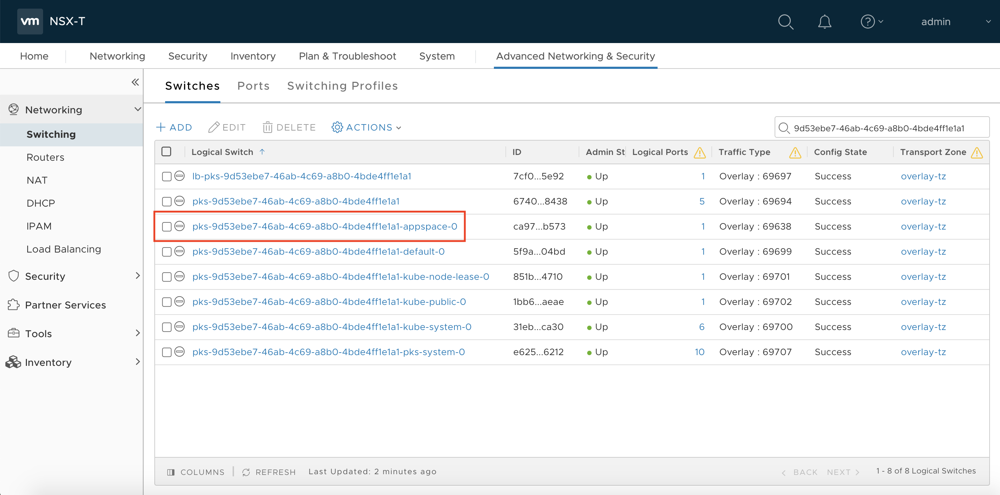
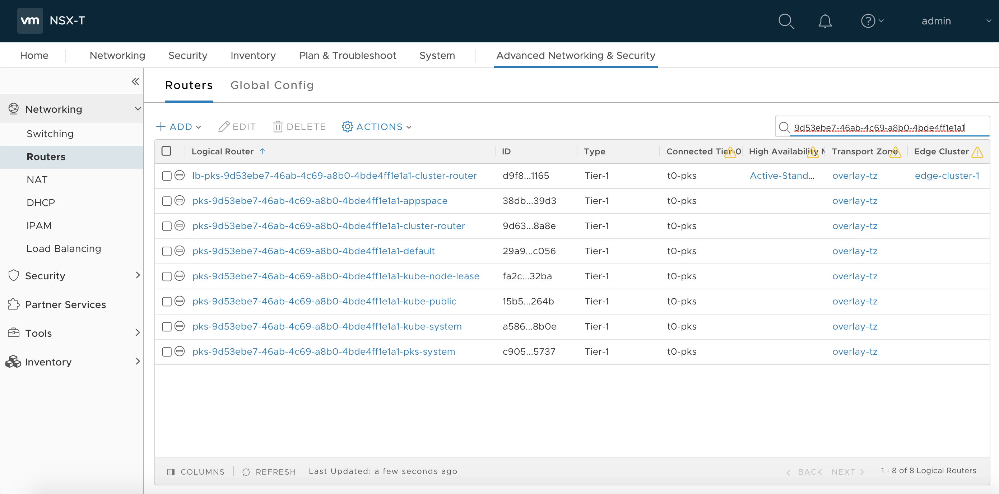

# Kubernetes Network Policy and NSX-T DFW Integration

In this demo, we are going to walk through the process of using the Kubernetes construct of [Network Policies](https://kubernetes.io/docs/concepts/services-networking/network-policies/) to ensure workloads running in a Kubernetes clusters are secured from a network perspective. For those unfamiliar with the Network Policy construct in the Kubernetes world, they are essentially "firewall" rules that can be applied to certain services or pods to restrict pod to pod communication as well as communication between the external network and pods in the Kubernetes cluster.

## The NSX Container Plugin

As part of the integration between Enterprise PKS and NSX-T, the [NSX Container Plugin (NCP)](https://docs.vmware.com/en/VMware-NSX-T-Data-Center/2.4/com.vmware.nsxt.ncp_kubernetes.do) is responsible for reaching out to the NSX-T Manager API to create networking resources to correlate with the Kubernetes resources that are created by the developers via `kubectl` commands. For instance, back in our [second demo](https://github.com/mann1mal/zPod-PKS-CSE-Demos/tree/master/GuestbookDemo), when we created a namespace to support application deployments, the NCP instructed the NSX-T Manager to create a new /24 network and T1 router to support pods running in this new namespace.

To verify this workflow, log in to the [NSX-T manager](https://nsx.pks.zpod.io) and navigate to the **Advanced Network and Security** tab. Select the **Switching** category if it isn't already selected. Type the UUID of the demo-cluster(`9d53ebe7-46ab-4c69-a8b0-4bde4ff1e1a1`) into the search bar and you will see the NSX-T logical switches created for each namespace in the cluster, including the `appspace` namespace. You can also navigate to the **Routers** tab, search on the cluster UUID and point out the T1 routers for each namespace:

Among other things, the NCP also handles the creation of NSX-T Distributed Firewall Rules when developers create Network Policies in their kubernetes clusters to help extend the level of microsegmentation available to "traditional" compute resources into the kubernetes world. We will walk through this workflow in detail utilizing the Yelb app deployment in the demo below.

### Accessing the `demo-cluster`

Before starting the demo, access the `cse-client` server from your Horizon instance via putty (pw is `VMware1!`):

Ensure you are accessing the `demo-cluster` via kubectl by using `cse` to pull down the cluster config file and store it in the default location, if you haven't done so in a previous lab. Use your vmc.lab AD credentials to log in to the `vcd-cli`:
~~~
$ vcd login director.vcd.zpod.io cse-demo-org <username> -iw
~~~
~~~
$ vcd cse cluster config demo-cluster > ~/.kube/config
~~~
~~~
$ kubectl get nodes
NAME                                   STATUS   ROLES    AGE     VERSION
0faf789a-18db-4b3f-a91a-a9e0b213f310   Ready    <none>   5d9h    v1.13.5
713d03dc-a5de-4c0f-bbfe-ed4a31044465   Ready    <none>   5d10h   v1.13.5
8aa79ec7-b484-4451-aea8-cb5cf2020ab0   Ready    <none>   5d10h   v1.13.5
~~~

## Step 1: Exploring Network Policies and Distrubuted Firewall Rules

**1.1** First, set a namespace for the default context to ensure workloads are deployed to the `appspace` namespace by default:
~~~
$ kubectl config set-context --current --namespace=appspace
~~~
**1.2** If you did not deploy the Yelb app in the last demo, do so now:
~~~
$ kubectl create -f yelb-ingress.yaml
~~~
**1.3** Test connectivity to the Yelb UI at `yelb.demo.pks.zpod.io` to confirm the app deployed succesfully:

**Note:** Chrome has been known to hold onto webpage cache so please use incognito mode/private browsing as you try to access the app before and after implementing the network polices.

**1.4** In a Kubernetes cluster, if there is no Network Policy defined, Kubernetes allows all communication, by default. This means all pods can talk to each other freely, as well as communicate with external resources. This may work in some cases, especially in dev/test environments, but teams can use Network Policies to further restrict network communication between services in a Kubernetes cluster, if required.

First, create a policy that will deny all ingress access to the pods in the `appspace` namespace, from within and without the cluster. Navigate to the `~/zPod-PKS-CSE-Demos/NetworkPolicy` directory and create the `deny-all` policy:
~~~
$ cd ~/zPod-PKS-CSE-Demos/NetworkPolicy
~~~
~~~
$ kubectl create -f appspace-deny-all.yaml
~~~
**1.5** So let's take a look at what's happened in the NSX-T manager...

Navigate back to the NSX-T Manager webUI, select the **Advanced Network and Security** tab and then the **Security** > **Distrubuted Firewall Rule** tab on the left hand menu. Locate the `ip-pks-6e92c1a9-c8f2-4774-ba8b-7786e7fc8d50` firewall rule and expand the selection

**1.6** Here we can see the NCP reached out to the NSX-T Manager to create a DFW rule to drop traffic from source `Any` to a target port group. Click on the hyperlink for the target group and note this group is comprised of a /24 network. We can also see the name of the Kuberentes network policy present in the name of the target group:

**1.7** Navigate back to the `cse-client` putty session and examine the IP addresses of the pods providing the Yelb app:
~~~
$ kubectl get pods -o wide
NAME                              READY   STATUS    RESTARTS   AGE   IP 
redis-server-86f48f4875-5kf62     1/1     Running   0          15m   172.16.19.3   
yelb-appserver-66b579569f-hrfzf   1/1     Running   0          15m   172.16.19.5   
yelb-db-76c6f5d6fb-nj4fc          1/1     Running   0          15m   172.16.19.4   
yelb-ui-dcb8746fb-xf9g6           1/1     Running   0          15m   172.16.19.2   
~~~
The `172.16.19.0/24` network was created automatically when we created the namespace(by the NCP) to be utilized by pods in the `appspace` namespace. This network block was pulled from the `172.16.0.0/16` pool, which we assigned to be used for pod networks when we installed Enterprise PKS.

**1.8** Now that we confirmed we have blocked all traffic to all pods in the namespace, let's try to access the Yelb UI again. As expected, we can not access the webUI because the DFW rule is not allowing any traffic to reach the pods in the cluster. As a side note, the app itself is not functional as the deny-all Network Policy we have in place is not allowing the components of the app to communicate with each other.

So we've denied all communication by default, now we need to "poke holes" in the DFW to allow the required network connectivty the app requires to function as expected and also allow access from from outside the cluster.

For informational purposes, refer to the architecture of the Yelb app below to understand which pods need to communicate with each other:

**1.9** The `yelb-allow-netpol.yaml` file contains 5 Network Policies to allow pod to pod communication between all of the components as well as a policy that allows external access to the Yelb UI for external users. Feel free to review the `.yaml` file to understand more about each policy. Deploy the policies:
~~~
$ kubectl create -f yelb-allow-netpol.yaml
~~~
**1.10** Again, let's see what's happened in NSX-T. Navigate back to the **Distributed Firewall** section and notice we have new entries in the DFW table. Expand one of the new DFW rules and examine the contents:

**1.11** In the example above, we are allowing ingress and egress traffic between two target groups. Select the target group from each section and compare with `kubectl` output:

This rule is allowing traffic between the `yelb-appserver` pod (`172.16.19.5`) and the `redis-server` pod (`172.16.19.3`). Feel free to review the rest of the DFW rules created from the Network Policies.

**1.12** Now let's test the availability of the Yelb app from the browser:

And we're back in business!!

As a final test of the Network Policy configuration, let's make sure pods that aren't explicitly allowed to communicate with each other are, in fact, prevented from doing so.

**1.12** We are going to perform a couple of ping test from within the `yelb-ui` pod. First, we'll need to get the name of the pod:

**Note:** Pod names and IP addresses of pods will probably be different than the output shown here.
~~~
$ kubectl get pod -l app=yelb-ui
NAME                      READY   STATUS    RESTARTS   AGE
yelb-ui-dcb8746fb-xf9g6   1/1     Running   0          44m
~~~
**1.13** Review all the IP addresses of the pods:
~~~
$ kubectl get pods -o wide
NAME                              READY   STATUS    RESTARTS   AGE   IP 
redis-server-86f48f4875-5kf62     1/1     Running   0          15m   172.16.19.3   
yelb-appserver-66b579569f-hrfzf   1/1     Running   0          15m   172.16.19.5   
yelb-db-76c6f5d6fb-nj4fc          1/1     Running   0          15m   172.16.19.4   
yelb-ui-dcb8746fb-xf9g6           1/1     Running   0          15m   172.16.19.2   
~~~
**1.14** Access the shell of the `yelb-ui` pod:
~~~
$ k exec -it yelb-ui-dcb8746fb-xf9g6 -- /bin/bash
~~~
**1.14** If we refer to the Yelb arch diagram above, the `yelb-ui` pod should allow traffic to/from the external internet as well as to/from the `yelb-appserver` pod. Let's confirm this by pinging the IP of the appserver pod as well as a public internet address:
~~~
root@yelb-ui-dcb8746fb-xf9g6:/# ping 172.16.19.5   
PING 172.16.19.5 (172.16.19.5): 56 data bytes
64 bytes from 172.16.19.5: icmp_seq=0 ttl=64 time=2.319 ms
64 bytes from 172.16.19.5: icmp_seq=1 ttl=64 time=0.565 ms
2 packets transmitted, 2 packets received, 0% packet loss
~~~
~~~
root@yelb-ui-dcb8746fb-xf9g6:/# ping 8.8.8.8
PING 8.8.8.8 (8.8.8.8): 56 data bytes
64 bytes from 8.8.8.8: icmp_seq=0 ttl=51 time=4.921 ms
64 bytes from 8.8.8.8: icmp_seq=1 ttl=51 time=4.081 ms
2 packets transmitted, 2 packets received, 0% packet loss
~~~
**1.15** As expected, the pings are succesful. But let's test to see if we can ping the IP of a pod that the `yelb-ui` pod shouldn't be able to communicate with, the `yelb-db` pod:
~~~
root@yelb-ui-dcb8746fb-xf9g6:/# ping 172.16.19.4  
PING 172.16.19.4 (172.16.19.4): 56 data bytes
--- 172.16.19.4 ping statistics ---
5 packets transmitted, 0 packets received, 100% packet loss
~~~
As expected, the Kubernetes Network Policies, backed by NSX-T distributed firewall rules, are preventing traffic between these pods as we did not explicitly allow communication between the entities. Type `exit` to leave the shell of the pod and return to the cse-client command prompt.

## Step 2: Clean Up

**2.1** Clean up the environment by deleting the Network Policies as well as the Yelb application resources:
~~~
$ kubectl delete -f appspace-deny-all.yaml 
$ kubectl delete -f yelb-allow-netpol.yaml 
$ kubectl delete -f yelb-ingress.yaml 
~~~

**2.2** Log back in to the vCloud Director environment via the 'vcd-cli' and pull a fresh `demo-cluster` config file to reset cluster contexts:

~~~
$ vcd login director.vcd.zpod.io cse-demo-org <username> -iw
~~~
~~~
$ vcd cse cluster config demo-cluster > ~/.kube/config
~~~

## Conclusion

This demo showcases the integration between Enterprise PKS Kubernetes clusters and NSX-T with respect to utilizing Distributed Firewall rules to apply microsegmentation logic to Kubernetes workloads. With the NSX Container Plugin, developers can use native Kubernetes constructs to ensure their applications are secure while the creation of the firewall components are automated via the plugin.

The [next demo](https://github.com/mann1mal/zPod-PKS-CSE-Demos/tree/master/NamespaceIsolation) will take a look at the workflow for using the NCP in conjunction with Network Policies to provide network isolation per Kuberentes namespace.

