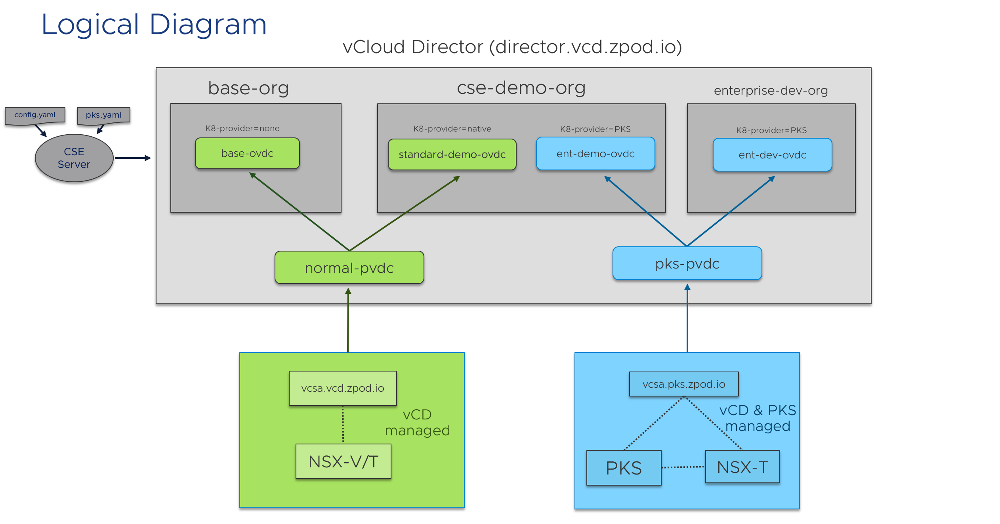

# CSE/PKS zPod Demo Scripts

This repo will serve as the staging area for demo scripts to deliver in the CSE/PKS zPod Environments. Most of these demos can also be utilized in any Enterprise PKS Kubernetes cluster backed by NSX-T with a bit of alteration.

1. [CSE Org Onboarding and RBAC Demo](https://github.com/mann1mal/zPod-PKS-CSE-Demos/blob/master/CSERBACDemo/README.md)
2. [Guestbook App Demo](https://github.com/mann1mal/zPod-PKS-CSE-Demos/tree/master/GuestbookDemo)
3. [Ingress and NSX-T Demo](https://github.com/mann1mal/zPod-PKS-CSE-Demos/tree/master/Ingress%26NSX-T)
4. [Kubernetes Network Policy and NSX-T DFW Integration](https://github.com/mann1mal/zPod-PKS-CSE-Demos/tree/master/NetworkPolicy)
5. [Namespace Network Isolation with Network Policies and NSX-T](https://github.com/mann1mal/zPod-PKS-CSE-Demos/tree/master/NamespaceIsolation)
6. [Using Harbor with Enterprise PKS](https://github.com/mann1mal/zPod-PKS-CSE-Demos/tree/master/UsingHarbor)
7. [Deploying Helm and Kubeapps](https://github.com/mann1mal/zPod-PKS-CSE-Demos/tree/master/Kubeapps)
8. [Backing Up an Application Using Velero](https://github.com/mann1mal/zPod-PKS-CSE-Demos/tree/master/VeleroBackup)
