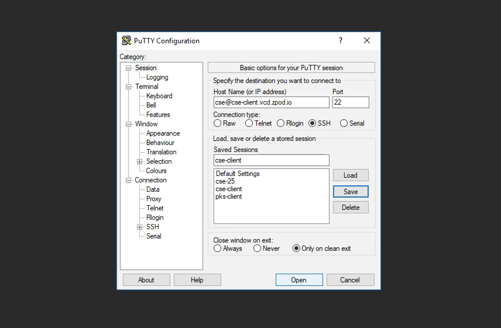
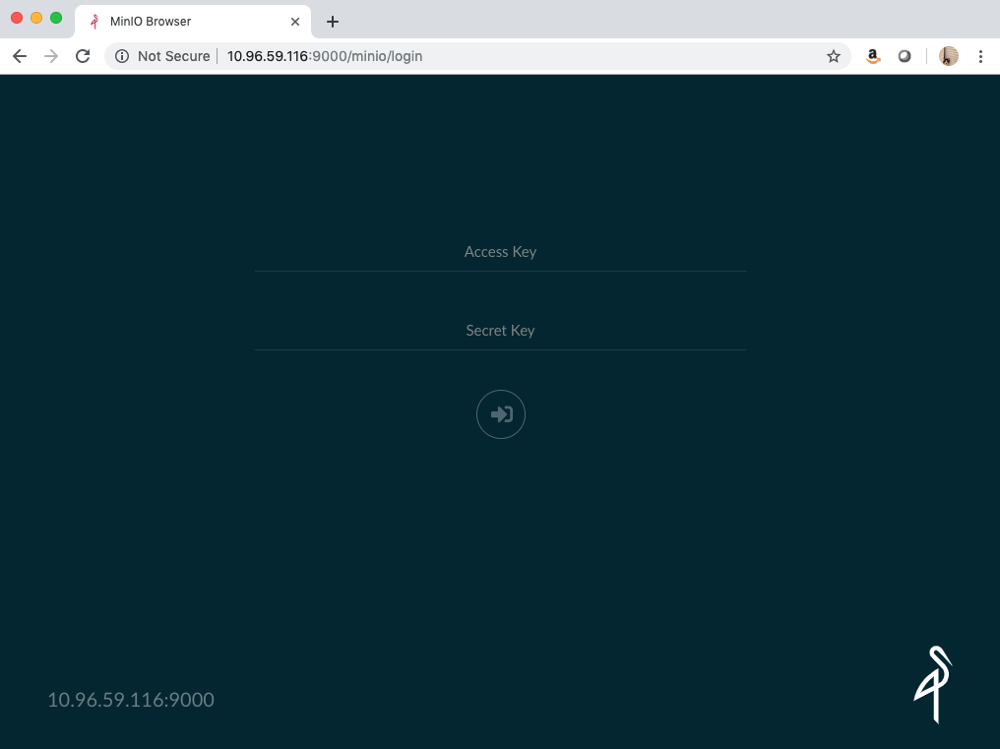
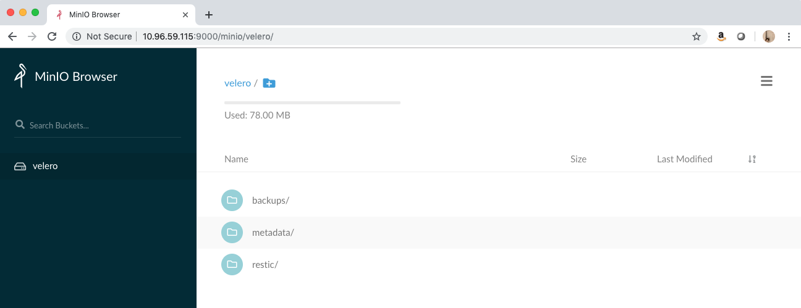
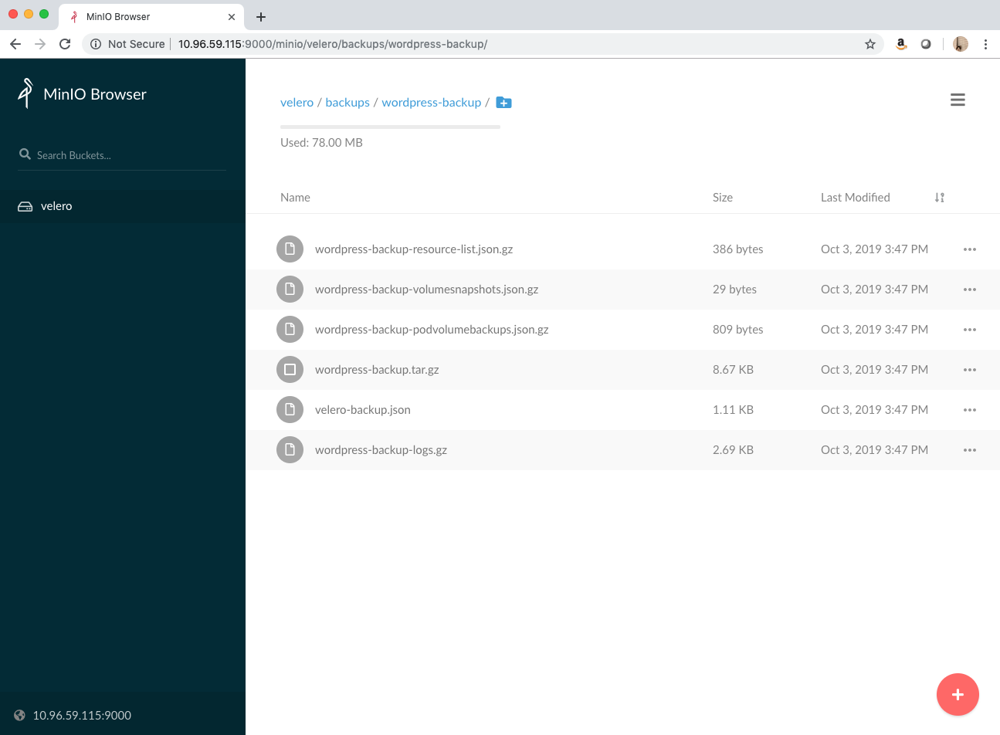
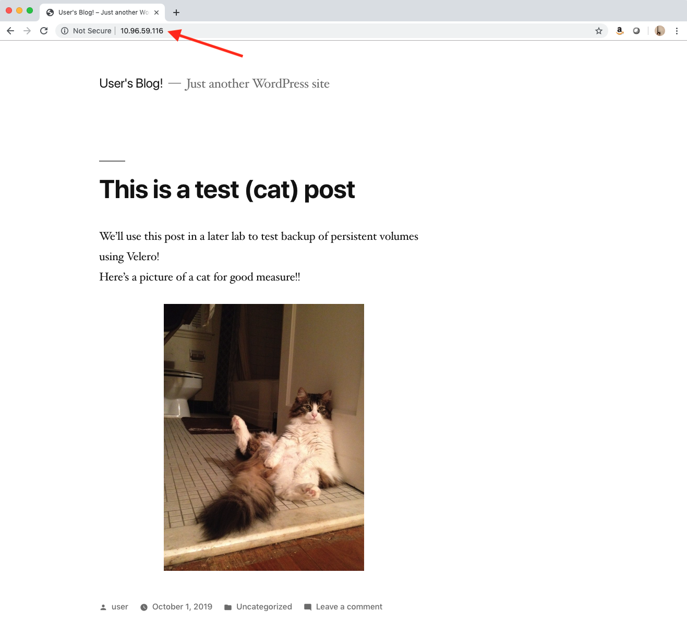

# Backing Up a Kubernetes Application with Velero ⛵

In this lab, you will install [Velero](https://velero.io/docs/v1.1.0/index.html) in the `demo-cluster`. You will then use Velero to take a backup of the Wordpress application, created in the previous lab. After taking a succesful backup, you will simulate a DR scenario by deleting the Wordpress application and all of it's support resources and use Velero to restore the application.

## Introduction to Velero

Velero is a backup and recovery solution built specifically to assist in the backup (and migration) of Kubernetes applications, including their persistent storage volumes. You can even use Velero to back up an entire Kubernetes cluster for restore and/or migration! Velero address various use cases, including but not limited to:

* Taking backups of your cluster to allow for restore in case of infrastructure loss/corruption
* Migration of cluster resources to other clusters
* Replication of production cluster/applications to dev and test clusters

Velero is essentially comprised of two components:

* A server that runs as a set of resources with your Kubernetes cluster
* A command-line client that runs locally (on the `cse-client` server, in this case)

Velero also supports the back up and restore of Kubernetes volumes using [restic](https://github.com/restic/restic), an open source backup tool. Restic will need to utilize a S3-compatible storage server to store these volumes. To satisfy this requirement, we will also deploy a [minio](https://min.io) server in the `demo-cluster` to allow us to store our Kubernetes volume backups. Minio is a cloud storage server compatible with Amazon S3.

In this lab, we will utilize Velero, in conjunction with restic and minio to take a backup of our Wordpress application and all of it's volumes.

### Prereqs

Ensure you have deployed the Wordpress application from the [previous lab](https://github.com/mann1mal/zPod-PKS-CSE-Demos/tree/master/Kubeapps), as we will use this application to test our Velero backup strategy.

### Accessing the `demo-cluster`

Before starting the demo, access the `cse-client` server with the `cse` user (`cse@cse-client.vcd.zpod.io`) from your Horizon instance via putty (pw is `VMware1!`):

Ensure you are accessing the `demo-cluster` via kubectl by using `cse` to pull down the cluster config file and store it in the default location, if you haven't done so in a previous lab. Use the `cse-ent-user` with password `VMware1!` to log in to the `vcd-cli`:

~~~
$ vcd login director.vcd.zpod.io cse-demo-org cse-ent-user -iw
~~~
~~~
$ vcd cse cluster config demo-cluster > ~/.kube/config
~~~
~~~
$ kubectl get nodes
NAME                                   STATUS   ROLES    AGE     VERSION
0faf789a-18db-4b3f-a91a-a9e0b213f310   Ready    <none>   5d9h    v1.13.5
713d03dc-a5de-4c0f-bbfe-ed4a31044465   Ready    <none>   5d10h   v1.13.5
8aa79ec7-b484-4451-aea8-cb5cf2020ab0   Ready    <none>   5d10h   v1.13.5
~~~

## Step 1: Installing Minio in `demo-cluster`

In this exercise, we will deploy all of the components required to support our Velero service. Feel free to review any and all .yaml files on the `cse-client` server for further information on what resources we are deploying in the cluster.

**1.1** On the `cse-client` server, navigate to the `VeleroBackup` directory:

~~~
cd ~/zPod-PKS-CSE-Demos/VeleroBackup
~~~

**1.2** Create the `velero` namespace to house our Velero installation in the cluster:

~~~
$ kubectl create namespace velero
~~~

**1.3** Create a `storageclass` for the Minio service to use for its persistent storage:

~~~
$ kubectl create -f minio-storage-class.yaml 
~~~

**1.4** Create a `persistentvolumeclaim` the Minio service will use to store the volume backups via restic. Also verify it was created and visible in the `velero` namespace:

~~~
$ kubectl create -f minio-pvc.yaml
~~~
~~~
$ kubectl get pvc -n velero

NAME          STATUS   VOLUME                                     CAPACITY   ACCESS MODES   STORAGECLASS   AGE
minio-claim   Bound    pvc-cc7ac855-e5f0-11e9-b7eb-00505697e7e7   6Gi        RWO            minio-disk     8s
~~~

**1.5** After creating the supporting resources for the Minio service, run the following command to create the deployment:

~~~
$ kubectl create -f minio-deploy.yaml 

deployment.apps/minio created
service/minio created
secret/cloud-credentials created
job.batch/minio-setup created
ingress.extensions/velero-minio created
~~~

**1.6** Use `kubectl` to wait for the `minio-xxxx` pod to enter the `Running` status:
~~~
$ kubectl get pods -n velero -w

NAME                    READY   STATUS              RESTARTS   AGE
minio-754667444-zc2t2   0/1     ContainerCreating   0          4s
minio-setup-skbs6       1/1     Running             0          4s
NAME                    READY   STATUS              RESTARTS   AGE
minio-754667444-zc2t2   1/1     Running             0          9s
minio-setup-skbs6       0/1     Completed           0          11s
~~~

**1.7** Expose the Minio service to requests outside of the cluster via a `LoadBalancer` service type with the following command:

~~~
$ kubectl expose deployment minio --name=velero-minio-lb --port=9000 --target-port=9000 --type=LoadBalancer --namespace=velero
~~~

**1.8** Use `kubectl` to retrieve the IP of the virtual server created within the NSX-T load balancer and access the Minio UI in your browser at <`EXTERNAL-IP`>:9000 (be sure to use port 9000) within your Horizon instance. You are looking for the IP address under the `EXTERNAL-IP` section for the `velero-minio-lb` service:
~~~
$ kubectl get services -n velero

NAME              TYPE           CLUSTER-IP       EXTERNAL-IP    PORT(S)          AGE
minio             ClusterIP      10.100.200.160   <none>         9000/TCP         7m14s
velero-minio-lb   LoadBalancer   10.100.200.77    10.96.59.116   9000:30711/TCP   12s
~~~
**Note**: There is currently a "bug" in the zPod environment that is preventing the Minio UI from loading via the NSX-T LB, further troubleshooting required. The rest of the lab will still work as expected, you just won't be able to access the Minio UI via the broswer.

Now that Minio has been succesfully deployed in the `demo-cluster`, move on to the next section to install and configure Velero and restic.

## Step 2 Installing Velero and Restic in `demo-cluster`

Now that we have an s3-compatible storage solution deployed, we are ready to complete the installation of Velero (and restic)

**2.1** Examine the `credentials-velero` file that contains the credentials for access to the Minio service (username: `minio`, password: `minio123`). Velero will use these credentials to access Minio to store volume backups:

~~~
$ cat credentials-velero
~~~

**2.2** Use the Velero CLI client from the `cse-client` server to complete the installation of Velero (and restic):

~~~
$ velero install  --provider aws --bucket velero --secret-file credentials-velero \
--use-volume-snapshots=false --use-restic --backup-location-config \
region=minio,s3ForcePathStyle="true",s3Url=http://minio.velero.svc:9000,publicUrl=http://<public-ip-minio-service>:9000

---output omitted---

Velero is installed! ⛵ Use 'kubectl logs deployment/velero -n velero' to view the status.
~~~

**2.3** Verify that you have 3 `restic-xxx` and 1 `velero-xxx` pods deployed in the `velero` namespace:

**Note**: Notice the status of the `restic-xxx` pods...
~~~
$ kubectl get pod -n velero
NAME                      READY   STATUS             RESTARTS   AGE
minio-5559c4749-7xssq     1/1     Running            0          7m21s
minio-setup-dhnrr         0/1     Completed          0          7m21s
restic-mwgsd              0/1     CrashLoopBackOff   4          2m17s
restic-xmbzz              0/1     CrashLoopBackOff   4          2m17s
restic-235cz              0/1     CrashLoopBackOff   4          2m17s
velero-7d876dbdc7-z4tjm   1/1     Running            0          2m17s
~~~
**2.4** As you may notice, the restic pods are not able to start. That is because in Enterprise PKS Kubernetes clusters, the path to the pods on the nodes is a little different (/var/vcap/data/kubelet/pods) than in "vanilla" Kubernetes clusters (/var/lib/kubelet/pods). In order for us to allow the restic pods to run as expected, we need to edit the restic daemon set and change the hostPath variable as referenced below:
~~~
$ kubectl edit daemonset restic -n velero
~~~
~~~
volumes:
      - hostPath:
          path: /var/vcap/data/kubelet/pods
          type: ""
        name: host-pods
~~~

**2.5** Verify all of the `restic` pods are in `Running` status:

~~~
$ kubectl get pod -n velero

NAME                      READY   STATUS      RESTARTS   AGE
minio-5559c4749-7xssq     1/1     Running     0          12m
minio-setup-dhnrr         0/1     Completed   0          12m
restic-p4d2c              1/1     Running     0          6s
restic-xvxkh              1/1     Running     0          6s
restic-e31da              1/1     Running     0          6s
velero-7d876dbdc7-z4tjm   1/1     Running     0          7m36s
~~~

Congrats! You have succesfully deployed Velero and it's supporting services in the `demo-cluster`. Move on to the next section to test a backup and DR scenario with the Wordpress application created in a previous lab.

## Step 3: Backup and Restore the Wordpress Application using Velero

After deploying Velero, we will walk through the workflow of backing up our Wordpress application as well as simulating a DR scenario by deleting the `wordpress` namespace, which includes all of the resources we created in the previous lab to support the wordpress blog. Afterwards, we will use Velero to restore our backup and verify that persistant data, such as blog posts, is restored as well.

**3.1** Verify the Wordpress pods are in the `Running` status. If you have not deployed the Wordpress application in the `demo-cluster`, please refer to the [previous lab]((https://github.com/mann1mal/zPod-PKS-CSE-Demos/tree/master/Kubeapps)) for instructions on that process before proceeding.

~~~
$kubectl get pods -n wordpress

NAME                                  READY   STATUS    RESTARTS   AGE
cut-birds-mariadb-0                   1/1     Running   0          23h
cut-birds-wordpress-fbb7f5b76-lm5bh   1/1     Running   0          23h
~~~

**3.2** In order for Velero to understand where to look for persistent data to back up, in addition to other Kubernetes resources in the cluster, we need to annotate each pod that is utilizing a volume so Velero backups up the pods AND the volumes.

Review both of the pods in the `wordpress` namespace to view the name of each volume being used by each pod:

**Note**: Your `wordpress` pod will have a different name, use the pod name obtainined from step 3.2 in the following examples

~~~
$ kubectl describe pod/cut-birds-mariadb-0 -n wordpress

---output omitted---

Volumes:
  data:
    Type:       PersistentVolumeClaim (a reference to a PersistentVolumeClaim in the same namespace)
    ClaimName:  data-cut-birds-mariadb-0
    ReadOnly:   false
  config:
    Type:      ConfigMap (a volume populated by a ConfigMap)
    Name:      cut-birds-mariadb
    Optional:  false
  default-token-6q5xt:
    Type:        Secret (a volume populated by a Secret)
    SecretName:  default-token-6q5xt
    Optional:    false
~~~
~~~
$ kubectl describe pods/<wordpress-pod-name> -n wordpress

---output omitted---

Volumes:
  wordpress-data:
    Type:       PersistentVolumeClaim (a reference to a PersistentVolumeClaim in the same namespace)
    ClaimName:  cut-birds-wordpress
    ReadOnly:   false
  default-token-6q5xt:
    Type:        Secret (a volume populated by a Secret)
    SecretName:  default-token-6q5xt
    Optional:    false
~~~

As you can see, the `mariadb` pod is using 2 volumes: `data` and `config`, while the `wordpress` pod is utilizing a single volume: `wordpress-data`.

**3.3** Run the following commands to annotate each pod with the `backup.velero.io` tag with each pods' corresponding volume(s):

~~~
$ kubectl -n wordpress annotate pod/cut-birds-mariadb-0 backup.velero.io/backup-volumes=data,config
$ kubectl -n wordpress annotate pod/<wordpress-pod-name> backup.velero.io/backup-volumes=wordpress-data
~~~

**3.4** Use the `velero` client to create a backup. We will name the backup `wordpress-backup` and ensure the backup only includes the resources in the `wordpress` namespace:

~~~
$ velero backup create wordpress-backup --include-namespaces wordpress

Backup request "wordpress-backup" submitted successfully.
Run `velero backup describe wordpress-backup` or `velero backup logs wordpress-backup` for more details.
~~~

**3.5** Use the `velero` client to ensure the `Phase: Complete` before proceeding:
~~~
$ velero backup describe wordpress-backup

Name:         wordpress-backup
Namespace:    velero
Labels:       velero.io/storage-location=default
Annotations:  <none>

Phase:  Completed

--output omitted--
~~~
**3.6** Navigate back to the web browser and refresh (or log back into) the Minio UI. Notice the `restic` folder, which holds houses our backups persistent data, as well as a `backups` folder:

**3.7** Select the `backups` folder and note the `wordpress-backup` folder in the subsequent directory. Explore the contents of the `wordpress-backup` folder, which contains all of the Kubernetes resources from our `wordpress` namespace:

**3.8** Obtain the URL (`EXTERNAL-IP` value, `10.96.59.120` in the example below) with the following `kubectl` command. Visit the URL in your browser to confirm the current state of the blog:
~~~
$ kubectl get svc -n wordpress

NAME                  TYPE           CLUSTER-IP       EXTERNAL-IP    PORT(S)                      AGE
cut-birds-mariadb     ClusterIP      10.100.200.235   <none>         3306/TCP                     23h
cut-birds-wordpress   LoadBalancer   10.100.200.201   10.96.59.120   80:31761/TCP,443:31144/TCP   23h
~~~

**3.9** Navigate back to the `cse-client` server putty session. To simulate a infrastructure failure, delete the `wordpress` namespace, which will remove all of the resources that support our Wordpress application. Use `kubectl` to check the "before" and "after" states for the namespace deletion:
~~~
$ kubectl get pods -n wordpress
$ kubectl get pvc -n wordpress
~~~
~~~
$ kubectl delete namespace wordpress
~~~
~~~
$ kubectl get pods -n wordpress
$ kubectl get pvc -n wordpress
~~~

**3.9** After confirming all of the resources in the `wordpress` namespace have been deleted, refresh the browser you used to access the blog previously and confirm the blog is not available.

**3.10** Use the `velero` client to verify the existance/name of the backup that was previously created and restore the backup to the cluster:

~~~
$ velero backup get

NAME               STATUS      CREATED                         EXPIRES   STORAGE LOCATION   SELECTOR
wordpress-backup   Completed   2019-10-03 15:47:07 -0400 EDT   29d       default            <none>
~~~
~~~
$ velero restore create --from-backup wordpress-backup
~~~

**3.11** Monitor the pods in the `wordpress` namespace and wait for both pods to show `1/1` in the `READY` column and `Running` in the `STATUS` column:

~~~
$ kubectl get pods -n wordpress -w

NAME                                  READY   STATUS     RESTARTS   AGE
cut-birds-mariadb-0                   0/1     Init:0/1   0          12s
cut-birds-wordpress-fbb7f5b76-qtcpp   0/1     Init:0/1   0          13s
cut-birds-mariadb-0                   0/1     PodInitializing   0          18s
cut-birds-mariadb-0                   0/1     Running           0          19s
cut-birds-wordpress-fbb7f5b76-qtcpp   0/1     PodInitializing   0          19s
cut-birds-wordpress-fbb7f5b76-qtcpp   0/1     Running           0          20s
cut-birds-mariadb-0                   1/1     Running           0          54s
cut-birds-wordpress-fbb7f5b76-qtcpp   1/1     Running           0          112s
~~~

**3.12** Verify the URL of the Wordpress blog:
~~~
$ kubectl get services -n wordpress

NAME                  TYPE           CLUSTER-IP      EXTERNAL-IP    PORT(S)                      AGE
cut-birds-mariadb     ClusterIP      10.100.200.39   <none>         3306/TCP                     2m56s
cut-birds-wordpress   LoadBalancer   10.100.200.32   10.96.59.116   80:32393/TCP,443:31585/TCP   2m56s
~~~

**3.13** Access the URL of the blog in the web broswer, confirm the test post is still present:

## Step 4: Clean Up

**4.1** Delete the `wordpress` namespace to remove the Wordpress application and all of its supporting resources. Confirm all pods, persistent volume claims, and services have been deleted from the namespace:

~~~
$ kubectl delete namespace wordpress
~~~
~~~
$ kubectl get pods,pvc,services -n wordpress
No resources found.
~~~

**4.2** Run the following commands to delete all of the components created to support the Velero application:

~~~
$ kubectl delete namespace/velero clusterrolebinding/velero
$ kubectl delete crds -l component=velero
~~~

## Conclusion

In this lab, we were able to install Velero, and all it's required components, in the `demo-cluster` to support taking backups of Kubernetes resources. We also walked through the process for taking a backup, simulating a data loss scenario, and restoring that backup to the cluster.

